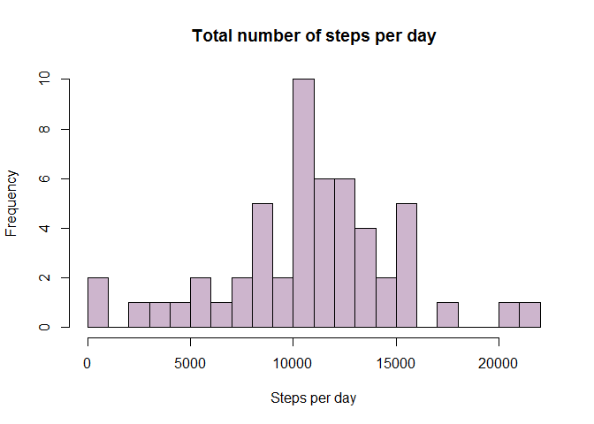
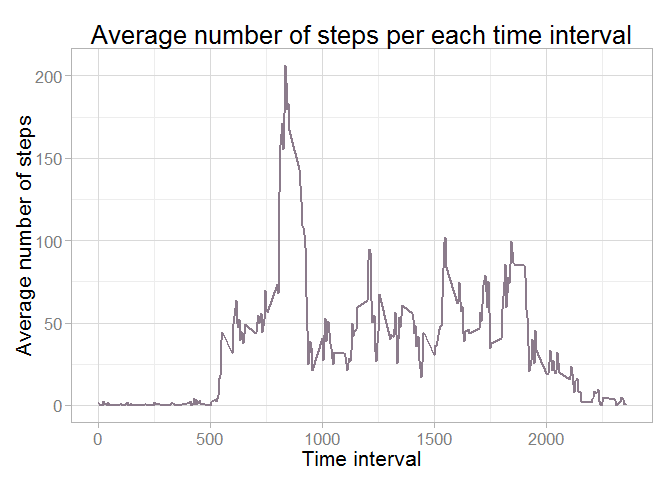
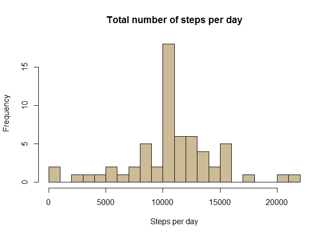
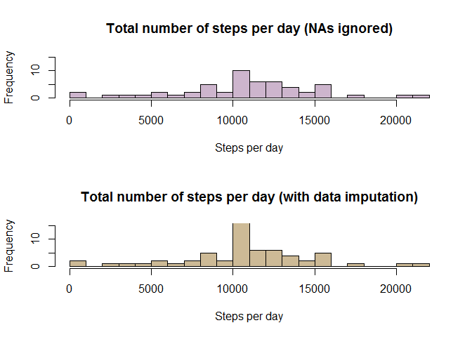
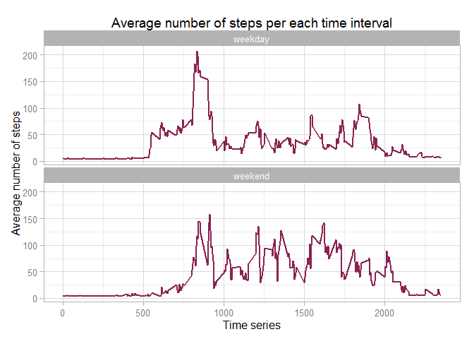

# Reproducible Research: Peer Assessment 1


## Loading and preprocessing the data
First, let's unzip activity.zip:

```r
unzip("activity.zip")
```
Check if the file is here in the working directory: 

```r
dir()
```

```
## [1] "activity.csv"       "activity.zip"       "doc"               
## [4] "instructions_fig"   "PA1_template.html"  "PA1_template.md"   
## [7] "PA1_template.Rmd"   "PA1_template_files" "README.md"
```
So here it is! NOw let's read the csv fle into activity variable:

```r
activity = read.csv("activity.csv")
```
We expect there to be 17,568 observations (from the assignment's instructions). So let's looks at the data structure:

```r
str(activity)
```

```
## 'data.frame':	17568 obs. of  3 variables:
##  $ steps   : int  NA NA NA NA NA NA NA NA NA NA ...
##  $ date    : Factor w/ 61 levels "2012-10-01","2012-10-02",..: 1 1 1 1 1 1 1 1 1 1 ...
##  $ interval: int  0 5 10 15 20 25 30 35 40 45 ...
```
So we have the data was loaded successfully. But we don't like the way the date variable looks, we need it to be stored as the data object. So let's parse the date strings into date objects:

```r
activity$date = as.Date(activity$date, "%Y-%m-%d")
```

## What is mean total number of steps taken per day?

#### Calculate the total number of steps taken per day
First, lets create a helper datafrme for date and steps. It will have 2 columns: date, steps, where date is the date of observation and steps is the total sum of steps for this date. We will use **aggregate** function for that. Note that not all the dates will be present in the resulting dataframe since some of the days have only missing values in them (for example the steps column for 2012-10-01 has all NAs in it). 

```r
library(reshape2)
date.to.steps = aggregate(steps ~ date, data = activity, sum)
```
Let's check the result:

```r
head(date.to.steps)
```

```
##         date steps
## 1 2012-10-02   126
## 2 2012-10-03 11352
## 3 2012-10-04 12116
## 4 2012-10-05 13294
## 5 2012-10-06 15420
## 6 2012-10-07 11015
```

#### Make a histogram of the total number of steps taken each day
And now let's make a histogram:

```r
hist(date.to.steps$steps, 
     breaks = 30,
     main = "Total number of steps per day",
     xlab = "Steps per day",
     col = "thistle3"
     )
```

 

#### Calculate and report the mean and median of the total number of steps taken per day
Now let's find the mean and the median of the number of steps per day. Since we already have a dataframe with all the necessary info, we will just use basic R functions to do that:


```r
mean(date.to.steps$steps)
```

```
## [1] 10766.19
```

```r
median(date.to.steps$steps)
```

```
## [1] 10765
```
And looks liks that's it for part1 of the assignment. :)

## What is the average daily activity pattern?
#### Make a time series plot (i.e. type = "l") of the 5-minute interval (x-axis) and the average number of steps taken, averaged across all days (y-axis)
The first task in this part is to build a plot of time series, where there is time interval values (5,10,15,20,25...) on x-axis and the average number of steps for each interval on the y-axis. Each day has a time series: each day has only one 5 min, 10 min, 15 min and so on interval. So we can simply aggregate by interval using the mean as the aggregate function. Again, since we want to ignore NA values, aggregate function is the optimal choice and we don't even have to bother about NAs. 

```r
time.to.step = aggregate(steps ~ interval, data = activity, mean)
```
Check the result:

```r
head(time.to.step)
```

```
##   interval     steps
## 1        0 1.7169811
## 2        5 0.3396226
## 3       10 0.1320755
## 4       15 0.1509434
## 5       20 0.0754717
## 6       25 2.0943396
```
Now let's build a line graph:

```r
library(ggplot2)
g = ggplot(time.to.step, aes(x=interval, y = steps))
g + theme_light(base_size=16)+
        geom_smooth(size = 1, aes(group=1), stat="identity",color = "thistle4") +
        labs(title = "Average number of steps per each time interval") +
        labs(x = "Time interval", y = "Average number of steps")
```

 

####Which 5-minute interval, on average across all the days in the dataset, contains the maximum number of steps?
This is a one-liner. We simple find the maximum value in the steps column of time.to.step dataframe (where steps is the AVERAGE number of steps) and extract the time interval value from this row

```r
time.to.step$interval[which.max(time.to.step$steps)]
```

```
## [1] 835
```

## Imputing missing values
####Calculate and report the total number of missing values in the dataset (i.e. the total number of rows with NAs)
The easiest way is to use an R function complete.cases which returns a logical vector: it has TRUE for rows of the input data don't have any missing values and FALSE otherwise. If we simply sum this vector we'll get the number of complete (no NAs) rows. So we can simply subtract this number from the total number of rows:

```r
missing = nrow(activity) - sum(complete.cases(activity))
missing
```

```
## [1] 2304
```
####Devise a strategy for filling in all of the missing values in the dataset. The strategy does not need to be sophisticated. For example, you could use the mean/median for that day, or the mean for that 5-minute interval, etc.
As we can immdiately notice, the first strategy (imputing mean for that day) is absolutely useless, since there are days with no data at all (e.g., 2012-10-01 - all NAs). The easiest way is to just replace the missing values with the mean. It's also a reasonable strategy because we only have 2 variable to use for our predictions: date and interval. 
It's obivious that there is missing data only in steps column, but let's actually check that:

```r
sum(is.na(activity$steps))
```

```
## [1] 2304
```

```r
sum(is.na(activity$interval))
```

```
## [1] 0
```

```r
sum(is.na(activity$date))
```

```
## [1] 0
```

So basically we should only care about one column. My approach is to build a regression model based on the interaval values. For the regression model I'm going to use only non-NA rows:


```r
reg = lm(steps ~ interval, data=activity, subset=!is.na(steps))
```
Now lest predict the values for the whole dataset:

```r
prediction <- predict (reg, activity) 
```
#### Create a new dataset that is equal to the original dataset but with the missing data filled in.
Here I will replace ONLY the missing values in the original dataset with the predictions:

```r
selvect = is.na(activity$steps)
activity$steps[selvect] = prediction[selvect]
```
Check we no longer have the missing values:

```r
sum(is.na(activity$steps))
```

```
## [1] 0
```
####Make a histogram of the total number of steps taken each day and Calculate and report the mean and median total number of steps taken per day. Do these values differ from the estimates from the first part of the assignment? What is the impact of imputing missing data on the estimates of the total daily number of steps?
So basically we need to redo the first part of the assignment. 

```r
date.to.steps = aggregate(steps ~ date, data = activity, sum)
hist(date.to.steps$steps, 
     breaks = 30,
     main = "Total number of steps per day",
     xlab = "Steps per day",
     col = "wheat3"
     )
```

 

```r
mean(date.to.steps$steps)
```

```
## [1] 10766.19
```

```r
median(date.to.steps$steps)
```

```
## [1] 10766.19
```

Let's actually compare the two histograms:

 

We can see that the overalall picture is very similar to the one that was generated with the data ignoring NAs. Except for one thing: the middle bar of the histogram looks higher on the second plot. And this is quite logical. First, we have more data now for the histogram (2304 observations more to be precise).


## Are there differences in activity patterns between weekdays and weekends?
####Create a new factor variable in the dataset with two levels - "weekday" and "weekend" indicating whether a given date is a weekday or weekend day.

First we'll write a function that will return "weekend" if the date is weekend, and "weekday otherwise"


```r
weekday_or_weekend <- function(date) {
        ifelse(weekdays(date) %in% c("Saturday","Sunday"), "weekend", "weekday")
        }
```

Now we will mutate the dataset and create a new column with weekday/weekend values in it. Then we'll convert it into a factor variable.


```r
library(dplyr)
```

```
## 
## Attaching package: 'dplyr'
## 
## The following object is masked from 'package:stats':
## 
##     filter
## 
## The following objects are masked from 'package:base':
## 
##     intersect, setdiff, setequal, union
```

```r
activity = mutate(activity, weekday = weekday_or_weekend(date))
activity$weekday = as.factor(activity$weekday)
```

####Make a panel plot containing a time series plot (i.e. type = "l") of the 5-minute interval (x-axis) and the average number of steps taken, averaged across all weekday days or weekend days (y-axis). See the README file in the GitHub repository to see an example of what this plot should look like using simulated data.

```r
agg_data = aggregate(steps ~ interval+weekday, data = activity, mean)
str(agg_data)
```

```
## 'data.frame':	576 obs. of  3 variables:
##  $ interval: int  0 5 10 15 20 25 30 35 40 45 ...
##  $ weekday : Factor w/ 2 levels "weekday","weekend": 1 1 1 1 1 1 1 1 1 1 ...
##  $ steps   : num  5.96 4.34 4.1 4.13 4.05 ...
```

```r
g = ggplot(agg_data, aes(x = interval, y = steps))
g + theme_light(base_size=12) +
        facet_wrap( ~ weekday, nrow = 2, ncol=1) +        
        geom_smooth(size = 1, aes(group=1), stat="identity",color = "violetred4") +        
        labs(title = "Average number of steps per each time interval") +
        labs(y = "Average number of steps", x = "Time series")       
```

 


